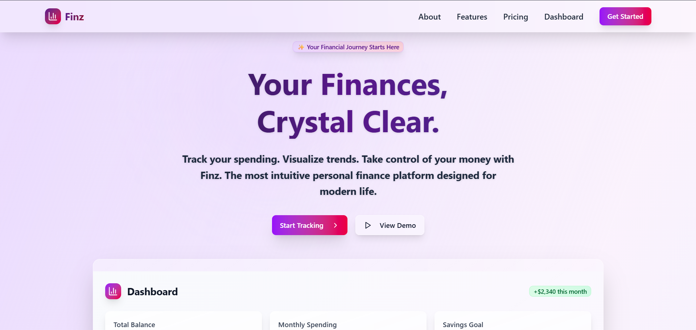

# 💸 Finz – Your Personal Finance Visualizer

**Finz** is a modern, minimalistic web application that helps you **track, visualize, and manage your personal finances** with ease. From everyday expenses to monthly overviews, Finz provides clear insights into where your money is going — all wrapped in a beautiful, glassmorphic interface.

---

## ✨ Features

-   📥 Add, edit, and delete financial transactions
-   📅 View your expenses over time by category and date
-   📊 Beautiful bar charts for monthly overviews (powered by Recharts)
-   🧊 Glassmorphic UI with a calming pastel theme
-   ✅ Responsive design for mobile, tablet, and desktop
-   🔐 Secure, local-first experience (MongoDB backend)

---

## 🧠 Tech Stack

-   **Frontend:** Next.js, React, Tailwind CSS, shadcn/ui
-   **Charts:** Recharts
-   **Backend:** MongoDB (via API routes)
-   **Design:** Glassmorphism + soft gradient aesthetics

---
